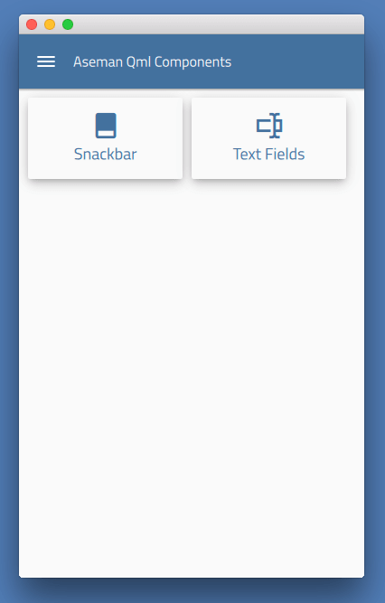

# Aseman Qml Components
===

###Material Design components built using Qt/QML and [Aseman Tools](https://github.com/Aseman-Land/aseman-qt-tools)

## Required dependencies to Build

* [Aseman Tools](https://github.com/Aseman-Land/aseman-qt-tools)
* Qt 5.9 or later